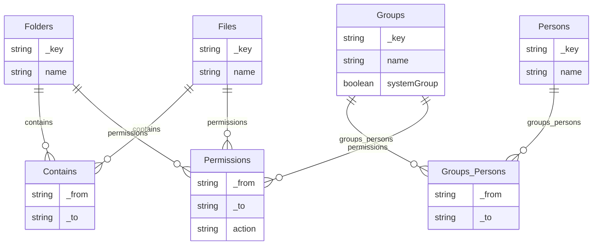

# File System Management API | API do sistema de gerenciamento de sistema de arquivos

### Descrição

API para gerenciar um sistema de arquivos, permitindo a criação, organização e controle de acesso a diretórios e arquivos. Utiliza o banco de dados [ArangoDB](https://www.arangodb.com/) para armazenar as informações e relacionamentos entre os recursos. A API oferece funcionalidades para criar, popular e consultar dados de forma eficiente.

### Funcionalidades

- Gerenciamento de Diretórios e Arquivos: criação, organização e controle de acesso a diretórios e arquivos.
- Controle de Acesso: Definição de permissões para grupos de usuários sobre diretórios e arquivos.
- Consultas Avançadas: Realização de consultas complexas para listar participantes de grupos, recursos associados a grupos, e permissões de acesso.

### DER - Diagrama Entidade Relacionamento



## Instalação

Toda a interagir com a aplicação deve ser realizada através do Makefile.

```bash
Comandos disponíveis:
	make up         - 🚀 Construir e rodar os contêineres
	make down       - 🛑 Parar e remover os contêineres
	make clean      - 🧹 Limpar volumes e imagens
	make logs       - 📜 Exibir os logs dos contêineres
	make stats      - 📈 Exibir o uso de recursos pelos contêiners em execução
	make seed       - 🌱 Popular banco de dados
	make exec       - ⌨️  Acessar console do contêiner
	make arangosh   - ⌨️  Acessar console Arangosh
	make help       - ❔ Acessar comandos disponíveis
```

### 1. 🚀 Construir e rodar os contêineres: 

```bash
make up
```

### 2. 🌱 Popular banco de dados

```bash
make seed
```

### ⌨️ Acessar console Arangosh

```bash
make arangosh
```

## Executar consutlas AQL e/ou visualizar gráficos

### Acesse o [GUI do ArangoDB](http://localhost:8529/) informando: 

```bash
Usuário: root
Senha: password
Banco de dados: file_system_management_db
```

### Consultas e views AQL

#### Permissões 

View:
```bash
FOR doc IN permissions_view
RETURN doc
```

Exemplo da mesma view utilizando filtros:
```bash
FOR doc IN permissions_view
RETURN doc
```

Consulta AQL com o mesmo propósito: 
```bash
FOR permission IN permissions
    FILTER permission._from == CONCAT('groups/', @groupId)
    LET target = DOCUMENT(permission._to)
    LET group = DOCUMENT(permission._from)
    RETURN {
        groupName: group.name,
        targetName: target.name,
        action: permission.action
    }
```
#### Mover diretório ou arquivo

```bash
const db = require('@arangodb').db;

const oldParentId = "folders/oldParentFolderId";
const newParentId = "folders/newParentFolderId";
const itemId = "folders/folderToMoveId"; // ou "files/fileToMoveId"
const itemType = "folder"; // ou "file"

const result = db._query(`
    RETURN NOOPT(FUNCTION('myNamespace::changeParentDirectory', @oldParentId, @newParentId, @itemId, @itemType))
`, { oldParentId, newParentId, itemId, itemType }).toArray();

console.log(result);
```

## Pendências com o Levi

- [ ] Permissões descendo | Inbound e outbound (front: caixa de texto digitação) 
- [ ] Ir para diretório
- [ ] para descer, limitar a 1
- [ ] Views para simplificar acesso
- [ ] Procedures para facilitar alterações